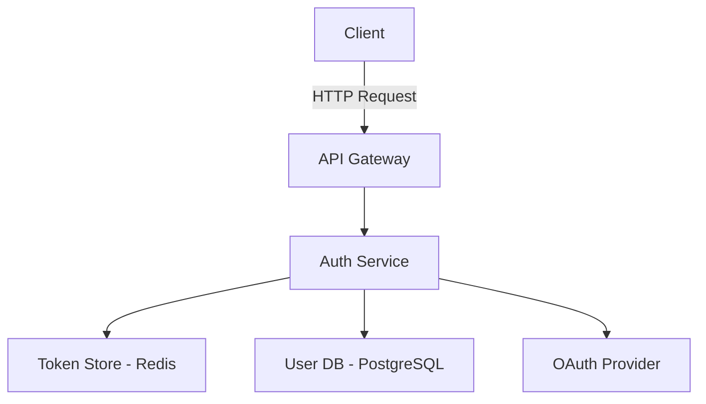

# REQ-XXX: <設計タイトル>

## Overview
<設計対象の概要を2-3文で記述>

例：
ユーザー認証機能の設計。OAuth2.0またはJWTベースの認証方式を検討し、セキュリティ要件とパフォーマンス要件を満たす最適な実装を選定する。

## Design Alternatives

### 案1: <設計案の名前>

**概要**
<設計案の概要を2-3文で記述>

**アーキテクチャ**
```
<コンポーネント図、データフロー、モジュール構成などを記述>
または Mermaid 図を使用
```

**メリット**
- メリット1: <詳細>
- メリット2: <詳細>
- メリット3: <詳細>

**デメリット**
- デメリット1: <詳細>
- デメリット2: <詳細>
- デメリット3: <詳細>

**実装複雑度**: Low / Med / High

**主要リスク**
<技術的リスクを1-2文で記述>

---

### 案2: <設計案の名前>

**概要**
<設計案の概要を2-3文で記述>

**アーキテクチャ**
```
<コンポーネント図、データフロー、モジュール構成などを記述>
```

**メリット**
- メリット1: <詳細>
- メリット2: <詳細>
- メリット3: <詳細>

**デメリット**
- デメリット1: <詳細>
- デメリット2: <詳細>
- デメリット3: <詳細>

**実装複雑度**: Low / Med / High

**主要リスク**
<技術的リスクを1-2文で記述>

---

### 案3: <設計案の名前>（オプション）

**概要**
<設計案の概要を2-3文で記述>

**アーキテクチャ**
```
<コンポーネント図、データフロー、モジュール構成などを記述>
```

**メリット**
- メリット1: <詳細>
- メリット2: <詳細>
- メリット3: <詳細>

**デメリット**
- デメリット1: <詳細>
- デメリット2: <詳細>
- デメリット3: <詳細>

**実装複雑度**: Low / Med / High

**主要リスク**
<技術的リスクを1-2文で記述>

---

## Comparison Matrix

| 評価軸 | 案1: <名前> | 案2: <名前> | 案3: <名前> |
|--------|------------|------------|------------|
| **実装工数** | 5人日 | 8人日 | 3人日 |
| **保守性** | High | Med | Low |
| **パフォーマンス** | 100ms | 50ms | 200ms |
| **スケーラビリティ** | High | Med | Low |
| **チームの習熟度** | High | Med | Low |
| **技術的負債** | Low | Med | High |
| **セキュリティ** | High | High | Med |
| **拡張性** | High | Med | Low |

## Recommended Solution

### 採用案: <選定した設計案の名前>

**選定理由**
<なぜこの設計を選んだのかを1-2段落で詳述>

例：
案1を採用する。主な理由は以下の3点である。
1. **保守性の高さ**: モジュール構成がシンプルで、チームメンバー全員が理解しやすい
2. **セキュリティ要件への適合**: OAuth2.0標準に準拠し、脆弱性リスクが最小化される
3. **既存システムとの親和性**: 現行の認証基盤と統合しやすく、移行コストが低い

案2はパフォーマンス面で優位だが、実装複雑度が高く長期的な保守コストが増大するリスクがある。案3は短期開発には適しているが、スケーラビリティとセキュリティの面で要件を満たさない。

**トレードオフ**
<何を犠牲にしたか、なぜそれが許容できるかを明記>

例：
- **パフォーマンス**: 案2と比較してレスポンスタイムが約2倍（50ms → 100ms）になるが、要件の200ms以内は十分満たしており、ユーザー体験への影響は軽微
- **初期開発速度**: 案3と比較して開発期間が約2倍になるが、長期的な保守性を優先する判断

## Detailed Design

### アーキテクチャ



### コンポーネント設計

#### 1. Auth Service
- **責務**: 認証処理、トークン生成・検証、セッション管理
- **技術スタック**: Node.js + Express + Passport.js
- **配置**: `src/services/auth/`

#### 2. Token Store
- **責務**: アクセストークンとリフレッシュトークンの保存
- **技術スタック**: Redis (TTL: 1時間)
- **配置**: インフラ層（Docker Compose で管理）

#### 3. User DB
- **責務**: ユーザー情報の永続化
- **技術スタック**: PostgreSQL
- **スキーマ**:
  ```sql
  CREATE TABLE users (
    id UUID PRIMARY KEY,
    email VARCHAR(255) UNIQUE NOT NULL,
    hashed_password VARCHAR(255),
    oauth_provider VARCHAR(50),
    oauth_id VARCHAR(255),
    created_at TIMESTAMP,
    updated_at TIMESTAMP
  );
  ```

### データモデル

#### User Entity
```typescript
interface User {
  id: string;
  email: string;
  hashedPassword?: string;  // ローカル認証の場合のみ
  oauthProvider?: 'google' | 'github';
  oauthId?: string;
  createdAt: Date;
  updatedAt: Date;
}
```

#### Token Payload
```typescript
interface TokenPayload {
  userId: string;
  email: string;
  exp: number;  // 有効期限（Unix timestamp）
  iat: number;  // 発行日時（Unix timestamp）
}
```

### API 設計

#### POST /auth/login
```json
Request:
{
  "email": "user@example.com",
  "password": "********"
}

Response (200):
{
  "accessToken": "eyJhbGc...",
  "refreshToken": "dGhpc2lz...",
  "expiresIn": 3600
}
```

#### POST /auth/refresh
```json
Request:
{
  "refreshToken": "dGhpc2lz..."
}

Response (200):
{
  "accessToken": "eyJhbGc...",
  "expiresIn": 3600
}
```

#### POST /auth/logout
```json
Request:
{
  "accessToken": "eyJhbGc..."
}

Response (204):
No content
```

### セキュリティ対策

1. **パスワード保護**: bcrypt でハッシュ化（cost factor: 12）
2. **トークンセキュリティ**:
   - アクセストークン: 1時間で期限切れ
   - リフレッシュトークン: 7日間で期限切れ、1回限り使用
3. **通信暗号化**: 全てのエンドポイントで HTTPS 必須
4. **レート制限**: 1IPあたり10リクエスト/分（ログイン・パスワードリセット）
5. **CSRF対策**: SameSite Cookie 属性を使用

### パフォーマンス最適化

- Redis によるトークンキャッシュ（検証時のDB負荷削減）
- Connection pooling（PostgreSQL: 最大20接続）
- トークン検証時のJWT signature caching

## Trade-offs & Risks

### 受け入れるトレードオフ

| トレードオフ | 理由 |
|------------|------|
| レスポンスタイム 100ms（案2の2倍） | 要件の200ms以内を満たし、保守性を優先 |
| 開発期間 5人日（案3の約2倍） | 長期的な保守コスト削減を重視 |
| Redis 依存の追加 | トークン管理の高速化とスケーラビリティ向上のため必要 |

### 主要リスクと対策

| リスク | 発生確率 | 影響度 | 対策 |
|--------|---------|--------|------|
| Redis 障害時の認証停止 | Low | High | Redis Sentinel でHA構成、フェイルオーバー自動化 |
| OAuth Provider の API 制限 | Med | Med | 複数プロバイダ対応、ローカル認証のフォールバック |
| トークン漏洩リスク | Low | High | 短い有効期限、HTTPSのみ、Secure Cookie 属性 |

## Implementation Guidelines

### ファイル配置

```
src/
  services/
    auth/
      auth.service.ts       # 認証ロジック
      token.service.ts      # トークン生成・検証
      passport.config.ts    # Passport.js 設定
  routes/
    auth.routes.ts          # 認証API ルート
  middleware/
    auth.middleware.ts      # 認証ミドルウェア
  models/
    user.model.ts           # User エンティティ定義
```

### 技術的決定事項

1. **JWT ライブラリ**: `jsonwebtoken` (業界標準、十分な実績)
2. **暗号化アルゴリズム**: RS256（公開鍵/秘密鍵ペア）
3. **パスワードハッシュ**: bcrypt（Argon2 は Node.js での実績が少ないため見送り）
4. **セッション管理**: ステートレス（JWT）+ Redis（リフレッシュトークン）

### 実装順序

1. User モデルとDB マイグレーション
2. Token Service（生成・検証）
3. Auth Service（ローカル認証）
4. OAuth 統合（Google）
5. ミドルウェアとエラーハンドリング
6. レート制限とセキュリティ強化

### コーディング規約

- **エラーハンドリング**: カスタム例外クラス（`AuthenticationError`, `TokenExpiredError`）を使用
- **ログ出力**: 認証成功/失敗を全てログに記録（個人情報はマスク）
- **テストカバレッジ**: 80%以上（特にトークン検証とセキュリティ周り）

## Open Questions

<未解決の質問・ユーザーへの確認事項>

例：
- [ ] OAuth Provider は Google のみで良いか？GitHub や Microsoft も必要か？
- [ ] トークンの有効期限は1時間で適切か？もっと長くする必要はあるか？
- [ ] 2要素認証（2FA）は将来的に必要になる可能性があるか？
- [ ] 既存ユーザーの移行方法は？パスワードリセットフローが必要か？

---
*Created: YYYY-MM-DD*
*Last updated: YYYY-MM-DD*
*Design version: 1.0*
