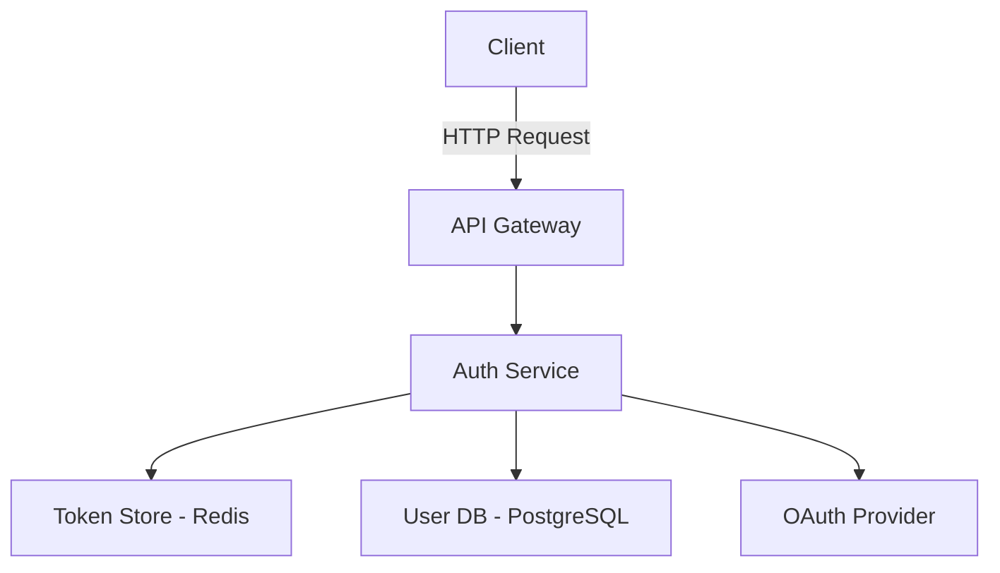

# <Design Title>

## Overview
<Describe the overview of the design target in 2-3 sentences>

Example:
Detailed design of user authentication functionality. This document elaborates Alternative 1 (JWT + Passport.js) selected in design-alternatives.md to an implementation-ready level.

## Selected Design

### Design Approach: <Selected Design Alternative Name>

**Alternatives Evaluation**
This design adopts Alternative <N> evaluated in `design-alternatives.md`.

**Selection Rationale Summary**
<Summarize the selection rationale from design-alternatives.md in 1-2 paragraphs>

Example:
Alternative 1 (JWT + Passport.js) was selected. The main reasons are:
1. **High Maintainability**: Simple module composition that all team members can easily understand and extend
2. **Security Compliance**: Adheres to OAuth2.0 standards, minimizing vulnerability risks and meeting regulatory requirements
3. **Existing System Compatibility**: Easy integration with current authentication infrastructure, resulting in low migration costs

**Key Trade-offs**
<Summarize the trade-offs identified in design-alternatives.md>

Example:
- **Performance**: Response time is approximately 2x compared to session-based approach (50ms → 100ms), but it well satisfies the 200ms requirement, and the impact on user experience is minimal
- **Initial Development Speed**: Development period is approximately 2x compared to SaaS approach, but we prioritize long-term maintainability and data ownership

## Detailed Design

### Architecture



### Component Design

#### 1. Auth Service
- **Responsibility**: Authentication processing, token generation/verification, session management
- **Tech Stack**: Node.js + Express + Passport.js
- **Location**: `src/services/auth/`

#### 2. Token Store
- **Responsibility**: Storage of access tokens and refresh tokens
- **Tech Stack**: Redis (TTL: 1 hour)
- **Location**: Infrastructure layer (managed by Docker Compose)

#### 3. User DB
- **Responsibility**: Persistence of user information
- **Tech Stack**: PostgreSQL
- **Schema**:
  ```sql
  CREATE TABLE users (
    id UUID PRIMARY KEY,
    email VARCHAR(255) UNIQUE NOT NULL,
    hashed_password VARCHAR(255),
    oauth_provider VARCHAR(50),
    oauth_id VARCHAR(255),
    created_at TIMESTAMP,
    updated_at TIMESTAMP
  );
  ```

### Data Models

#### User Entity
```typescript
interface User {
  id: string;
  email: string;
  hashedPassword?: string;  // Only for local authentication
  oauthProvider?: 'google' | 'github';
  oauthId?: string;
  createdAt: Date;
  updatedAt: Date;
}
```

#### Token Payload
```typescript
interface TokenPayload {
  userId: string;
  email: string;
  exp: number;  // Expiration (Unix timestamp)
  iat: number;  // Issued at (Unix timestamp)
}
```

### API Design

#### POST /auth/login
```json
Request:
{
  "email": "user@example.com",
  "password": "********"
}

Response (200):
{
  "accessToken": "eyJhbGc...",
  "refreshToken": "dGhpc2lz...",
  "expiresIn": 3600
}
```

#### POST /auth/refresh
```json
Request:
{
  "refreshToken": "dGhpc2lz..."
}

Response (200):
{
  "accessToken": "eyJhbGc...",
  "expiresIn": 3600
}
```

#### POST /auth/logout
```json
Request:
{
  "accessToken": "eyJhbGc..."
}

Response (204):
No content
```

### Security Measures

1. **Password Protection**: Hashed with bcrypt (cost factor: 12)
2. **Token Security**:
   - Access token: Expires in 1 hour
   - Refresh token: Expires in 7 days, single-use
3. **Communication Encryption**: HTTPS required for all endpoints
4. **Rate Limiting**: 10 requests/minute per IP (login & password reset)
5. **CSRF Protection**: Use SameSite Cookie attribute

### Performance Optimization

- Token caching with Redis (reduces DB load during verification)
- Connection pooling (PostgreSQL: max 20 connections)
- JWT signature caching during token verification

## Trade-offs & Risks

### Accepted Trade-offs

| Trade-off | Reason |
|-----------|--------|
| Response time 100ms (2x of Alternative 2) | Meets 200ms requirement, prioritizes maintainability |
| Development period 5 person-days (approx. 2x of Alternative 3) | Emphasizes long-term maintenance cost reduction |
| Added Redis dependency | Necessary for token management speedup and scalability improvement |

### Key Risks & Mitigation

| Risk | Probability | Impact | Mitigation |
|------|------------|--------|------------|
| Authentication outage during Redis failure | Low | High | HA configuration with Redis Sentinel, automated failover |
| OAuth Provider API rate limits | Med | Med | Multi-provider support, local authentication fallback |
| Token leakage risk | Low | High | Short expiration, HTTPS only, Secure Cookie attribute |

## Implementation Guidelines

### File Structure

```
src/
  services/
    auth/
      auth.service.ts       # Authentication logic
      token.service.ts      # Token generation/verification
      passport.config.ts    # Passport.js configuration
  routes/
    auth.routes.ts          # Authentication API routes
  middleware/
    auth.middleware.ts      # Authentication middleware
  models/
    user.model.ts           # User entity definition
```

### Technical Decisions

1. **JWT Library**: `jsonwebtoken` (industry standard, sufficient track record)
2. **Encryption Algorithm**: RS256 (public/private key pair)
3. **Password Hashing**: bcrypt (Argon2 deferred due to limited Node.js track record)
4. **Session Management**: Stateless (JWT) + Redis (refresh tokens)

### Implementation Order

1. User model and DB migration
2. Token Service (generation/verification)
3. Auth Service (local authentication)
4. OAuth integration (Google)
5. Middleware and error handling
6. Rate limiting and security hardening

### Coding Conventions

- **Error Handling**: Use custom exception classes (`AuthenticationError`, `TokenExpiredError`)
- **Logging**: Log all authentication successes/failures (mask personal information)
- **Test Coverage**: 80% or higher (especially around token verification and security)

## Open Questions

<Unresolved questions / items to confirm with user>

Example:
- [ ] Is Google the only OAuth Provider needed? Are GitHub or Microsoft also required?
- [ ] Is a 1-hour token expiration appropriate? Is a longer duration needed?
- [ ] Is two-factor authentication (2FA) potentially needed in the future?
- [ ] How will existing users be migrated? Is a password reset flow required?

---
*Created: YYYY-MM-DD*
*Last updated: YYYY-MM-DD*
*Design version: 1.0*
